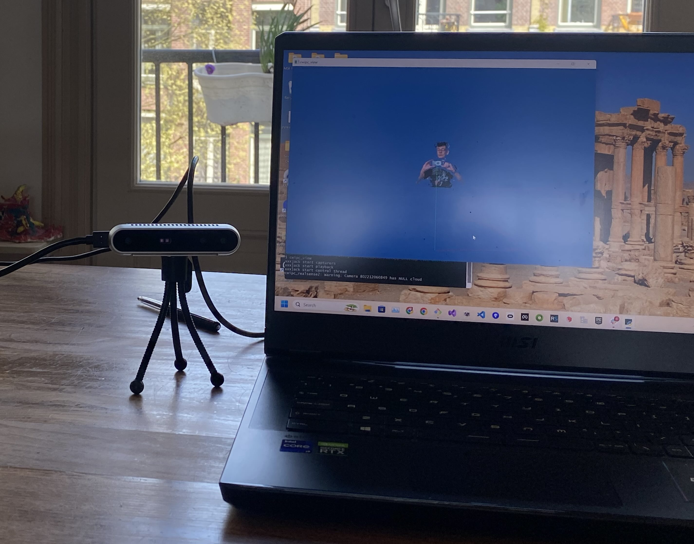

# Setting up your cameras

Currently _cwipc_ supports Microsooft Kinect Azure and Intel RealSense D400 series cameras. It also supports pre-recorded footage of those cameras, as `.mkv` or `.bag` files. See below.

> Both types are fully supported on Windows. On Linux both types should be supported, but this has not been tested recently. On Mac only the Realsense cameras are supported, but there are major issues at the moment (bascially you have to run everything as `root`).

You should first _register_ your cameras. This creates a file `cameraconfig.json` that will have information on camera serial numbers, where each camera is located and where it is pointed, and how the captured images of the cameras overlap. This information is needed to be able to produce a consistent point cloud from your collection of cameras.

The preferred way to use your cameras is to put them on tripods, in _portait mode_, with all cameras having a clear view of the floor of your _origin_, the natural "central location" where your subject will be. But see below for situations where this is not possible.

> For testing it may be possible that you don't have to do any registration at all, see the _Head and Shoulders_ section below.

You need to print the [origin marker](../cwipc_util/data/target-a4-aruco-0.pdf). If that link does not work: you can also find the origin marker in your installation directory, in `share/cwipc/registration/target-a4-aruco-0.pdf`, or online, at <https://github.com/cwi-dis/cwipc_util/blob/master/data/target-a4-aruco-0.pdf>.

Registering your cameras consists of a number of steps:

- Setup your hardware. 
- Use _cwipc\_register_ to find your cameras. This gives you an unaligned `cameraconfig.json`.
- Use _cwipc\_register_ to locate the origin marker in every camera, giving you a coarse alignment in `cameraconfig.json`.
- Use _cwipc\_register_ to do fine alignment.
- Manually edit `cameraconfig.json` to limit the point clouds to the subject (removing floor, walls, ceiling, etc).

Each of these steps is explained below.

## cwipc_register

The `cwipc_register` command line utility is the swiss army knife to help you setup your cameras, but it is rather clunky at the moment. An interactive GUI-based tool will come at some point in the future.

Use `cwipc_register --help` to see all the command line options it has. For now, we will explain the most important ones only:

- `cwipc_register` without any arguments will try to do all of the needed steps (but it is unlikely to succeed unless you know exactly what you are doing).
- The `--verbose` option will show verbose output, and it will also bring up windows to show you the result of every step. Close the window (or press `ESC` with the window active) to proceed with the next step.
- The `--rgb` will use the RGB and Depth images to do the coarse registration (in stead of the point clouds), if possible. This will give much better results. 
- The `--interactive` option will show you the point cloud currently captured. You can press `w` in the point cloud window to use this capture for your calibration step. If `--rgb` is also given you will be shown the captured RGB data, in a separate window. The `--rgb_cw` and `--rgb_ccw` options can be given to rotate the RGB images.

So, with all of these together, using `cwipc_register --rgb --interactive` may allow you to go through the whole procedure in one single step.

## Hardware setup

Ensure that all cameras are working (using _Realsense Viewer_ or _Azure Kinect Viewer_). If you have multiple cameras you are going to need _sync cables_ to ensure all the shutters fire simultanously for best results. See the camera documentation. You probably want to disable _auto-exposure_, _auto-whitebalance_ and all those.Set those to manual, and in such a way that the colors from all cameras are as close as possible.

You may need USB3 range extenders (also known as active cables) to be able to get to all of your cameras. Ensure these work within the camera viewer.

Put your origin marker on the floor and ensure all cameras can see it in RGB and Depth. The latter may be a bit difficult (because you can't see the marker in Depth). 

> **xxxjack here we need a screenshot**

Have a person stand at the origin and ensure their head is not cut off. Adjust camera angles and such. Lock down the cameras, all of the adjustable screws and bolts and such on your tripods. And lock the tripods to the floor with gaffer tape.

## Finding your cameras

The first step is to use `cwipc_register --noregister` to create a `cameraconfig.json` file that simply contains the serial number of every camera. If there already is such a file in the current directory this step does nothing. Remove the `cameraconfig.json` file if you want to re-run.

Usually it will find what type of camera you have attached automatically. If this fails you can supply the `--kinect` or `--realsense` option to help it.

## Coarse registration

The easiest way to do coarse calibration is to put the origin marker on the floor and run `cwipc_register --rgb --nofine`. This will run a coarse calibration step for each camera in turn, _but only if the camera has not been coarse-calibrated before_. In other words, you can run this multiple times if some cameras were missed the previous time. But on the other hand if you had to move cameras you should remove `cameraconfig.json` and restart at the previous step.

For each camera, the RGB image is used to find the origin marker Aruco pattern. The Depth image is then used to find the distance and orientation of the Aruco marker from the camera. This information is then used to compute the `4*4` transformation matrix from camera coordinates to world coordinates, and this information is stored in `cameraconfig.json`.

If the Aruco marker cannot be found automatically you can also use a manual procedure, by **not** supplying the `--rgb` argument. You will then be provided with a point cloud viewer window where you have to manually select the corners of the marker (using shift-click with the mouse) **in the right order**.

After this step you have a complete registration. You can run `cwipc_view` to see your point cloud. It should be approximately correct, but in the areas that are seen by multiple cameras you will see the the alignment is not perfect.

> **xxxjack here we need a screenshot**

## Fine registration

If you have only a single RGBD camera there is no point in doing fine calibration, but if you have multiple cameras it will slightly adjust the registration of the cameras to try and get maximum overlap of the point clouds.

> We are undecided whether it may be better to do this step after _Limiting your point clouds_. Experiment. See below.

Have a person stand at the origin.

Run `cwipc_register`. If there is already a complete coarse calibration for all cameras this will automatically do a fine calibration. If you are using `cwipc_register --interactive` type a `w` to capture a point cloud and start the registration.

The algorithm will iterate over the cameras, making slight adjustments to the alignment. When it cannot improve the results any more it stops and saves `cameraconfig.json`.

Check the results with `cwipc_view`.

> The algorithm is not perfect, and it can some times get into a local minimum. You will see this as a disjunct point cloud, often with cameras pairwise aligned and those pairs disaligned.
> 
> The workaround is to try fine alignment again, with the subject standing in a different pose.

## Limiting your point clouds

At this point, if you view your point cloud with `cwipc_view` you will see that it contains all the walls, floor, ceiling, furniture, etc.

> Currently you have to fix this by manually editing `cameraconfig.json`. It should be possible to edit `cameraconfig.json` while `cwipc_view` is running, and then typing `c` to reload `cameraconfig.json`. But this does not always work, you may have to stop and restart `cwipc_view` to see the result of your edits.

### Near and far points

The first thing to edit is `threshold_near` and `threshold_far`. These are the near and far point for all depth cameras (in meters). Adjust these to get rid of most of the walls, while keeping the whole target area visible. Looking at the floor is a good way to determine how you are doing.

### Radius

Only for Kinect there is another parameter you can play with: `radius_filter` applies a cylindrical filter around the origin.

### Repeat fine calibration

You now have a clean capture of the subject without walls and furniture, but with the floor still visible. This may be the best time to do the fine calibration.

> **xxxjack here we need a screenshot, or maybe two**

### Remove floor and ceiling

Next adjust `height_min` and `height_max` to get rid of floor and ceiling. Both have to be non-zero otherwise the filter will not be applied (but `height_min` can be less than zero if you want to keep the floor visible.

> **xxxjack here we need a screenshot**

### Color matching

You probably want to play with the various exposure parameters such as `color_whitebalance` and `color_exposure_time` to get the best color fidelity, but you really have to experiment here.

We are working on partially automating this process, but that is not done yet.

## Special cases

Here are some odds and ends that did not fit anywhere else.

### Registering pre-recorded footage

If you have pre-recorded footage (`.mkv` files for Kinect, `.bag` files for realsense) and you have captured some sort of a marker (either the Aruco origin marker, or the older four-color-corner marker) you can create a `cameraconfig.json` for this recording:

- Put all your files in a single directory, lets say `new-recording`.
- Run `cwipc_register --noregister new-recording`. This will create the initial `cameraconfig.json` inside that directory, with references to all the recording files.
- In that directory, run `cwipc_view --rgb`. Ignore the point cloud window but look at the RGB view to determine that the cameras are in sync.
- Manually edit `cameraconfig.json` to set in-points to sync the cameras, if needed. Recheck with `cwipc_view --rgb`.
- Run `cwipc_register --interactive --rgb --nofine`. Press `w` in the point cloud window when you see that all cameras have a good view of the marker in RGB space. This should give you a coarse calibration. Check it with `cwipc_view`.
- Do the _Limiting your point cloud_ steps, above.
- Now run `cwipc_register --interactive` when you see a point cloud that seems good for doing fine registration.

### Registering large spaces

If you have a large space, or if not all of your cameras can see the origin, you may still be able to do a registration using the _Auxiliary Aruco Markers_.

In the place where you found the `target-a4-aruco-0.pdf` there are 5 extra markers. These can be used as a "bread crumb trail": put the auxiliary markers on the floor in random places, but ensure that every marker can be seen by at least two cameras, and that there is a bread crumb trail from every marker back to the origin marker.

You may want to print the markers at 140% (i.e. on A3 paper).

`cwipc_register` will first do the coarse alignment only of the cameras that can see the origin marker. But after that it will have recorded the position of some of the auxiliary markers. It will then do a second pass, in which it will align the cameras that could see that second marker but not the origin marker. This is then repeated until all cameras are registered.

### Registering head-and-shoulders shots

There is a way to register a single camera without any makers at all. If your camera is in landscape orientation, at approximately `1.20m` height, and approximately `1m` away from a seated subject.

Incidentally, this is exactly what happens if you put the camera on your desk, on a small tripod, next to your monitor.

If you now run `cwipc_register --tabletop` you will get a `cameraconfig.json` that will capture a head and shoulders shot of you.

Here is a picture of the setup and the resulting point cloud in `cwipc_view`:

This is useful for developer testing, but it may also be usable for virtual meetings, etc.

